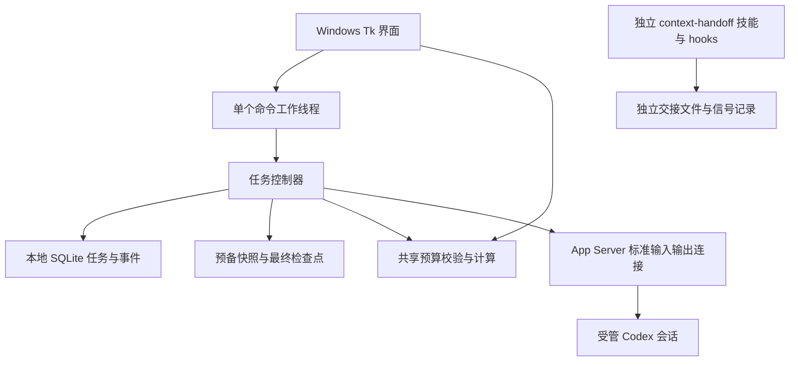

# 当前框架与完成边界

Context Relay 的 **Windows、本机、单用户、Codex 核心框架已经实现**，可以从任务创建走到执行、审批、暂停、交接与恢复。它仍是需要 Python/Tk/Codex 环境的源码运行版本；完整的远程、多工具会话管理平台尚未完成。

## 现有结构

界面只通过工作线程执行控制器操作；控制器拥有任务状态与执行归属；传输层负责原生请求、回执及通知。两个交接入口各用自己的状态记录：管理器不读取或修改 Codex 内部数据库，独立技能的 READY 也不能替代管理器的接管核验。

独立技能的 hooks 仍需在客户端审阅并信任；代码已经安装、手动检查通过和客户端全局自动触发是不同验收状态。

| 部分 | 已有能力 | 实际边界 |
|---|---|---|
| 启动与界面 | 当前用户桌面与开始菜单快捷方式、无控制台启动、可见错误、环境检查、任务列表、检索筛选、归档、操作记录 | 仍依赖源码及 Python 路径；环境检查只核对 Python/Tk/可执行文件，不证明登录、原生协议兼容或任务已启动 |
| 任务控制 | 稳定任务 ID、持久状态、单实例锁、权限上限、人工审批、任务设置、软预算 | 本地明文记录；没有操作系统级项目独占或硬性费用封顶 |
| 原生连接 | Codex App Server、请求与通知、超时结果保留、迟到回执、断线后的连接重建 | 只接 Codex；受管会话不等于官方桌面侧栏聊天 |
| 选择导入 | 正式接口检索与预览桌面 / IDE 聊天、来源指纹与独立摘录、重复防护、待启动任务 | 续办创建新受管会话，不接管原聊天；未加载状态不证明原端停止，工具/附件/旧审批不迁移 |
| 上下文交接 | 70% 预备、80% 加至少两次压缩的预防规则、最终摘要、六项 READY、执行权移交 | 阈值不衡量错误概率；自动高压力触发仍只有模拟覆盖 |
| 恢复 | 暂停、重启后只读核对、已知轮次终态校验、明确继续 | 缺失创建或执行回执且不能唯一确认时继续阻塞；不把超时理解为未执行，不自动重试 |
| 任务整理 | 本地归档、按任务保存窗口内输入、最近 100 条操作记录 | 归档不删除项目；窗口内未发送草稿不持久化；操作记录不是完整聊天或外部成功证明 |
| 备份 | 一致 SQLite 快照、导入摘录、完整事件与受管交接文件、版本化清单与校验、恢复到新目录 | 本地明文，不含项目或完整原生聊天；恢复库永久只读检视，不能证明备份之后的最新执行权 |

## 验证到什么程度

首版 `d6d7acf` 用 Codex 0.153.4 完成过同一任务跨三个原生会话、两次交接、实际继续工作的受控样例。可靠性版本 `8e429e0` 完成过立即暂停、确认中断、关闭重开、只读核对、明确继续和手动快照的原生样例。

之后的任务整理和设置改动通过模拟回归及本机真实 Tk/控制器演练，未把这些本地检查升级为新的原生交接验收。当前测试数量和每次验收记录见[使用与验证说明](windows-manager.md#验证状态)。物理断网、断电、系统崩溃、任意外部副作用恢复及其他环境仍未完整实测。

## 还缺什么

1. **稳定交付与维护：**独立安装包、升级与兼容策略、状态库版本迁移、可分享且经审阅的诊断资料。整库备份与只读资料恢复已有实现；恢复备份后安全接回活动执行仍缺少最新归属证明，不能用旧快照冒充当前执行权。
2. **完整的使用前检查：**登录状态、宿主协议能力及安全配置的实际核验；当前 `--check` 不覆盖这些内容。
3. **平台扩展：**手机远程控制及其认证、多工具／多模型接入、跨机器迁移、多人协作、系统托盘与开机运行。这些没有隐藏的后台实现。

推荐继续补稳定交付与诊断，再扩展远程访问。远程入口会增加认证和权限管理范围，多工具接入也需要逐一验证各自的暂停、恢复和交接语义；不能只增加一个适配接口就声称平台已完成。
